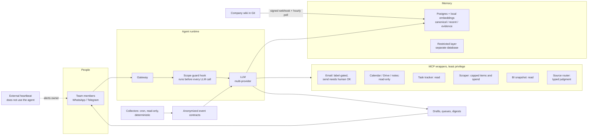

# 01 · Manolito: the operations agent a mortgage company runs on

| | |
|---|---|
| **Company** | LQN Hipotecas (mortgage platform, Colombia) |
| **My role** | Designed, built and operate it. Sole owner of the architecture and the permission model |
| **In production since** | May 2026 |
| **Usage** | 5,100+ sessions, 43 users, 75K tool calls (measured) |
| **Run cost** | USD 274–400 per month, all in |

## Context

A mortgage at LQN moves through four teams: sales, bank submission, pre-closing and closing, across 7 partner banks. The work lives in email, WhatsApp, Slack, a back-office system, BI reports and a task tracker. Nobody had one view of it. Coordinating operations meant spending most of the day checking queues, chasing people and writing status updates.

When the operations coordinator role opened up in mid-2026, the company did not refill it. The routine part of the job (monitoring, alerts, follow-up, reporting) had already moved to an agent I had been building since May.

## What I built

Manolito is an AI agent that people at LQN talk to on WhatsApp or Telegram. It runs on an open-source agent runtime (Hermes) on a single cloud server, with:

- **Memory.** The company wiki (see [case 09](09-knowledge-system-llm-wiki.md)) syncs into Postgres with local embeddings, split into layers: canonical, recent, evidence, and a restricted layer stored in a physically separate database. About 9.5K documents.
- **Tools.** 12 custom skills and 6 MCP servers. Each MCP server is a thin wrapper I wrote over one system: email (label-gated), calendar, drive and meeting notes (read-only), the task tracker, a scraper with hard spending caps, frozen BI snapshots, and a typed-judgment router that decides which source should answer a question.
- **Loops.** A dozen scheduled jobs: BI snapshot three times a day, per-person work queues, a morning control tower for team leads, twice-daily WhatsApp digests, a night research shift and a weekly learning cycle.
- **Guardrails.** A per-user scope guard, a transport-level block on group chats, drafts instead of sends, and an external heartbeat.

## Key decisions and trade-offs

**1. The agent reasons over contracts, not mailboxes.** The obvious way to make an "all-knowing" ops agent is to connect it to every employee's email and WhatsApp. I rejected it. A single agent holding live credentials for 69 people is one prompt injection away from leaking bank credentials and client data, and connections don't make an LLM learn anything anyway. Instead, small deterministic collectors read each source on a timer, strip personal data and write a stable event contract (source, stage, actor type, case hash, confidence, privacy level). The agent reads the contracts. Compromising the agent does not compromise anyone's inbox. The cost is latency: snapshots every 5 to 30 minutes instead of real time.

**2. The agent drafts. A human sends.** After a review with five adversarial "advisers" (an LLM council I run for big calls), I amended the rule above: Manolito can write emails and messages, but a named person always sends them from their own account. Outbound WhatsApp on behalf of people is banned for six months. A category of message can graduate to autonomous sending only after: 200+ drafts reviewed, 90%+ approved without substantial edits over four weeks, zero privacy incidents, a dedicated agent identity (never a person's mailbox), sign-off from two of three owners, an append-only send log and a pause button.

**3. Permissions live in a hook, not in the prompt.** A prompt is a suggestion. Before every LLM call, a hook identifies the sender and injects what that person may ask about: their own tasks and metrics, or the company view, or messages to third parties. Access is closed by default: one admin, everyone else has no access until activated. Out-of-scope attempts are logged and repeated ones alert me.

**4. Group chats are blocked at the transport layer.** See [what broke](#what-broke-and-what-i-learned).

**5. I dropped an inherited security-proxy design.** An early architecture routed agent traffic through an outbound proxy with an LLM-as-judge. It needed certificates, secrets and a second server, and it did not match what we actually ran. Governance now lives in wrappers, hooks, contracts, logs and human confirmation. Less magic, easier to audit.

**6. Learning cycles instead of reports.** The night research shift used to produce long lists of links. I replaced it with a weekly cycle that must close last week's hypothesis (confirmed, discarded, not enough evidence, or needs a human decision), pick one new falsifiable hypothesis with a baseline and a read date, and finish in under 10 minutes. It is forbidden to create tasks, contact people or change anything. Example: a backtest found that approved cases with a delivery date more than 30 days out advanced at 2.5% in a week versus 7.7% for the rest, so the cycle proposed tracking them as a separate segment and set a read date.

**7. A critical-reading standard.** The agent must state misses plainly, quantify the gap with a timestamp and a denominator, name the owner of the metric, and separate fact, signal, hypothesis and missing data. "There is movement in the funnel" is not allowed. "Three working days before month-end, disbursements are at X% of target and the gap is Y; stage changes do not close it" is.

## Results

| Result | Type |
|---|---|
| 5,100+ sessions, 43 users, 75K tool calls since May 2026 | Measured |
| Absorbed the routine layer of an operations coordinator role: about USD 4.3K/month (USD 51K/year) at USD 274–400/month run cost | Measured |
| Effect on loan approval rates where the agent's work queues were used | **Not proven** |

How I report the savings: I don't sell it as "a bot replaced a manager." I split the role into a routine layer (monitoring, alerts, coordination, 24/7 follow-up), which the agent absorbed, and a judgment layer (leading people), which was redistributed to humans. I report net savings and I named the leadership gap openly.

How I report what I could not prove: I tested whether the agent's queues improved approvals. A naive comparison showed +3.9 points. It disappeared once two banks with unusual volume were removed, and a regression discontinuity on the queue cutoff shrank to about +2 points (p = 0.13). I report it as not proven and proposed a randomized 20% holdout.

## What broke and what I learned

- **It replied inside a WhatsApp group.** The rule "never talk in groups" was in the prompt, and the bridge only dropped its own echoes, not messages from other participants. Fix: the bridge now drops all group traffic before the allowlist and returns 403 for any group send, and a preflight check refuses to start the service if an update removes the guard. A visible outage beats a public incident.
- **It was down for 3 hours and could not tell anyone.** A restart failed because a local bridge did not bind its port in time. The process supervisor does not auto-revive a restart that a human commanded. Fix: an external heartbeat every 5 minutes, through a separate bot channel, that also detects "alive but mute" (repeated 429s from the model provider). It only writes on state changes.
- **Disk full.** Old backups filled the disk, the agent could not write its state database, and the WhatsApp session had to be re-paired by hand. Lesson: backups need a retention policy and the disk needs watching. When you free space, never touch the live state.
- **Memory loss, twice.** First the hosted embeddings key was revoked and retrieval died; I moved embeddings to a local model. Then two processes writing to an embedded database corrupted it; I moved to Postgres and put a file lock on the refresh job.
- **Pages too large for the shell.** The memory CLI receives page content as an argument, and Linux caps argument size. Pages over 32 KiB now go in as header plus recent tail with an explicit compaction marker. The full source stays in Git.
- **Drift between server and repo.** The agent had committed directly on the server, which blocked the sync. Rule since then: the agent proposes changes through pull requests. The server mirrors `main`.

## Stack

Hermes agent runtime · OpenAI, Anthropic and Google models behind wrappers · MCP · Python · Postgres with local embeddings (Ollama) · systemd timers and cron · Composio for Google Workspace OAuth · WhatsApp and Telegram · Cloudflare Tunnel and Access · DigitalOcean
