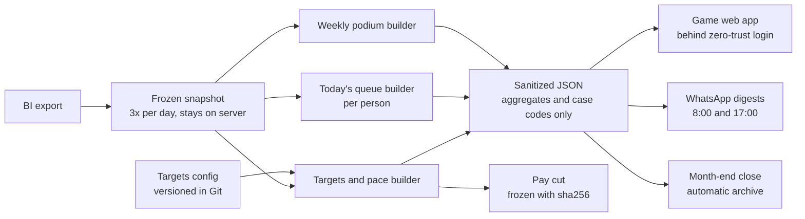

# 02 · LQN World: the loan pipeline as a game

| | |
|---|---|
| **Company** | LQN Hipotecas |
| **My role** | Product owner and main builder. A teammate redesigned two of the worlds; I own the data model, attribution rules and pay logic |
| **In production since** | July 2026 |
| **Reach** | 8 team dashboards, 30+ employees |
| **One-liner** | "The gamified operating system that moves every mortgage, from lead to disbursement, in real time." |

## Context

Monthly targets lived in spreadsheets. Teams found out how the month went when it was over. Each team lead built their own view, with their own definitions, and the numbers did not match between meetings. Starting in August 2026, the company also wanted part of variable pay to depend on these numbers, which raised the bar: a wrong number would now take money from someone.

## What I built

A web app styled like a retro platform game. Each stage of the mortgage funnel is a "world" (growth, sales, bank submission, pre-closing, closing) and there are views for leadership and for the operations agent itself. AI agents show up as power-ups that make a player more effective.

Under the game skin it is a data pipeline:

- **Frozen snapshots.** The operations agent ([case 01](01-manolito-ops-agent.md)) freezes the BI export three times a day. The raw file never leaves the server.
- **Builders.** Small Python jobs turn the snapshot into sanitized aggregate JSON: progress against target, required daily pace, and "today's 8 cases" per person, ranked by urgency, amount and days without action. Each case gets a concrete next step in mortgage language (missing documents, appraisal, title, signing, registry), not a generic "follow up".
- **Delivery.** A static site behind a zero-trust login, plus WhatsApp digests at 8:00 ("how the day starts") and 17:00 ("how it ended"), a Monday team podium, and an automatic month-end close that archives every dashboard's data.
- **Forecast.** "Estimated close at this pace" uses a 12-month, amount-weighted completion curve, not a straight-line projection. Disbursements land late in the month, so a straight line would have told the closing team they were failing on day 5.

## Key decisions and trade-offs

**1. Pay a floor, not a ranking.** The first version ranked people 1 to 100, and the ranking was going to pay. Five independent reviews (I ran them as red teams) said it should not, and I checked their findings against live data before changing anything. The individual monthly score had a reliability (ICC) of about 0.30; deciding money needs around 0.80. The best closer of the year was number one in only 3 of 12 months. The quality metric had an ICC of 0.12 and could be gamed by parking cases. So we pay a binary floor per job instead. A floor is judged by its false-negative rate, which we can measure directly: 1.4% to 4.5% depending on the job. It does not reward inflating volume above the floor. Everything else is shown as a thermometer labeled "DOES NOT PAY".

**2. Rules that protect people from bad data.** Shared cases split 1/n between everyone who owned them (70% of closings have two or more owners). Units are cases, not pesos, because ticket size varies 1.4x between people. If someone has activity on fewer than half the working days, they are "not calculable" and get paid by default, because missing attendance data is the company's problem. Whoever assigns the work does not compete. The pay cut is frozen with a sha256 hash, so the number used for payment can be reproduced by re-running the builder.

**3. Teams compete against their own past weeks.** The weekly podium compares each team with its previous weeks, not people with each other. One contract feeds every card, digest and report, so they all show the same number.

**4. "Last person who touched it" is not the owner.** The back-office export records who made the last change, not who owns the case. I tested nine derived attribution rules and none reproduced the official per-person numbers. So the daily queue is presented as a work signal, never as someone's portfolio, and no individual figure is published without reconciling to the official report. If the roster, column names or totals don't reconcile, publishing stops. Failing closed is better than paying the wrong person.

**5. The digest never mentions money.** It talks about the month's target and whether you are ahead or behind. The design keeps attention on the pace, not on the payout.

## Results

| Result | Type |
|---|---|
| 8 team dashboards used by 30+ employees, two WhatsApp digests a day, automatic month-end close | Measured |
| July 2026: 111.9% of the disbursement target, a single-day record of USD 4.6M, and the first positive EBITDA month of 2026 | Company result |

I don't attribute the July results to the dashboards. Many things changed that month. I also wrote down, in the area's own manual, that the metric that would justify this work ("disbursements enabled by the automation layer") was not yet measured, with a date to baseline it.

## What broke and what I learned

- **A schema change zeroed the podium for two weeks, with no error.** The BI source switched from a state table to a six-column event log. Dates and amounts disappeared, so every builder produced zeros, silently. Fix: builders read the current-state source, validate required columns and freshness, and refuse to publish on a mismatch. Lesson: know whether you are reading an event log or a current-state table, and treat every external source as a contract.
- **A bonus was calculated against an old target.** The sync to the server preserved a folder of runtime snapshots on purpose, and a config file lived in that folder. A target change merged in Git never reached the server. Fix: config follows `main`, runtime output is preserved, and the deploy wrapper re-installs itself when it changes.
- **Numbers that looked fine were inflated.** Attribution by touch inflated individual figures by 64%. Closings were double-counted 1.89x. A "same month" conversion card understated the real rate by 12 points because it divided this month's approvals by this month's submissions instead of following a cohort. The double count is now an audit test that runs before publishing, and individual figures must reconcile to the official report.
- **Two dashboards showed different values for the same metric** because they read different sources. Now there is one source per metric, and the cards say which one.
- **A red CI check was ignored for weeks.** People learned to merge on red. Fix it or delete it; never let red become normal.

## Stack

Python (standard library builders, unittest) · JSON data contracts · static HTML/JS · Cloudflare Pages and Access · systemd timers · WhatsApp Business API through a BSP · BI exports (Metabase, Power BI)
