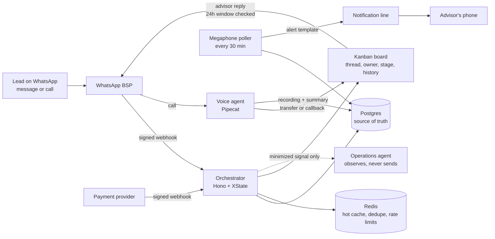

# 03 · WhatsApp CRM with a voice agent

| | |
|---|---|
| **Company** | LQN Hipotecas, plus two sister brands (Colex and HipoCredit) |
| **My role** | Product owner and builder, working with coding agents. I made the product calls, wrote the specs and ran every production deploy |
| **In production since** | August 2026 |
| **Results** | 181 leads in the first week, 78% with an identified source, 3 brands, card payments live |

## Context

Leads from brokers, ads and the website landed on one WhatsApp number. Advisors answered from their personal phones, so conversations split in two and nothing was recorded. Nobody knew which channel a lead came from or how long it waited for a reply. We looked at commercial CRMs with WhatsApp inboxes (Bitrix24, Kommo). Instead of copying one, I listed the capabilities we needed and built to that list: shared inbox, timeline per conversation, owner, 24-hour window handling, templates, stage automation, handoff and traceability.

## What I built

- **Intake bot.** An XState state machine greets new contacts, asks which of four paths they are on (new broker, referrer, training, active broker), collects what that path needs and assigns an advisor by turn the moment the path is chosen, so nobody who drops out ends up orphaned.
- **Kanban board with a real thread.** Advisors read and reply inside the card from the company line, not their own phone. Delivery ticks (sent, delivered, read, failed with a reason in Spanish). A full event history of every owner and stage change.
- **Unanswered-lead megaphone.** A poller checks every 30 minutes. A new lead without a reply after 1 hour, or a worked lead silent for 4 hours, triggers a WhatsApp alert to the owner from a separate notification line, only during business hours, with a cooldown. An alert counts as resolved if a human replies or moves the stage within 2 hours. A 6 pm digest goes to the admin.
- **Voice agent.** Calls to the line are answered by a voice agent built on Pipecat. If it cannot help, it asks whether to transfer now or schedule a callback. A live transfer rings the card owner for 15 seconds, then everyone; after 35 seconds it becomes a "call back" flag on the card. Advisors can also call out from the card through the browser. All calls are recorded with a spoken notice, transcribed and summarized, and kept for 90 days.
- **Attribution.** Click-to-WhatsApp ad click IDs captured on each card (with lead events prepared for the Meta Conversions API), page-level tags on every website button, and recognition of campaign codes in the first message.
- **Payments.** One brand charges a consulting fee. A button on the card creates a payment link; a signed webhook marks the fee as paid. Payments that match no card land in a separate inbox instead of being guessed.
- **Multi-brand.** Same code, three deployments. Each brand has its own database, cache namespace, domain, phone line and access list.

## Key decisions and trade-offs

**1. Postgres is the source of truth; Redis is a cache.** The first version kept conversation state only in Redis with a 24-hour TTL. That is fine for a bot's working memory, but it deleted cards after a quiet day. Postgres now holds the snapshot and the Kanban fields in separate columns; old Redis-only state migrates when it is next touched.

**2. Reply from the board, not from personal phones or the vendor console.** A `wa.me` link would have the advisor write from a personal number. The vendor console would take the advisor out of the card. The thread inside the board keeps every outbound message attributed and auditable. The cost: we now store full conversations, so the board went behind a zero-trust login.

**3. The 24-hour window fails closed.** Meta only accepts free text within 24 hours of the lead's last message. The window is computed from the last inbound message only. "Last activity" includes our own outbound messages and would show a window as open when it is not. A closed window returns 409 without calling Meta, and the UI offers a template.

**4. A human reply pauses the bot,** but only after Meta accepts the message. A rejected send should not silence the bot.

**5. LLMs never send.** One LLM drafts template copy without personal data. Another gives advisory triage over discrete buckets (no counts, IDs, text or phone numbers), and its output has every assign, modify and send capability hard-coded to false. Real sends require two independent flags (`ENABLED=true` and `DRY_RUN=false`), an HMAC-signed outbox, consent verified at send time, dedupe and per-lead and global rate limits. An ambiguous delivery result is reconciled, never retried automatically.

**6. One copy per brand, not three lines on one board.** The CRM identifies a card by phone number, and the brands have different customers and different P&Ls. A separate deployment kept that simple.

**7. Own login for the third brand.** The zero-trust provider is free up to 50 seats and then bills every seat. For the third brand I built an OTP login with daily caps, where a session dies when the user is removed from the allowlist.

## Results

| Result | Type |
|---|---|
| 181 leads in the first week, 78% with an identified source | Measured |
| Used by 3 brands, card payments live | Measured |
| Line-by-line audit of the whole codebase: 21 fixes shipped to production | Measured |

The audit found real issues, which is why I ran it: stored XSS through attachments, campaign attribution that never persisted for new leads, failed-delivery states that left a lead unanswered forever, every completed registration getting a "we had a problem" message, spreadsheet formula injection through a lead's name, a public webhook with no body size limit, and personal data in logs.

## What broke and what I learned

- **Meta rejected messages outside the 24-hour window,** and reclassified our alert templates from Utility to Marketing because the copy was persuasive, which changes the price. Neutral, report-style copy got approved as Utility.
- **8 of 19 alerts went out after hours,** and with a 72-hour threshold, alerts reached advisors after the 24-hour window had already closed. Alerts are now gated to business hours (accumulated ones go at 8:00) and the threshold for worked leads is 4 hours.
- **"Cards move by themselves."** A cancelled drag left an ID in memory, and dropping a file on a column moved that card. I fixed the bug, and the new event history table means the next report gets answered with "who moved it and when", not a guess.
- **The zero-trust login covered the webhook,** so the vendor's callbacks stopped arriving. Access rules are now scoped by path.
- **The CDN's bot protection blocked the payment provider,** which sends webhooks without a User-Agent. A rule now disables that check on one path only. The provider's own "test webhook" button returned 403 for our account, so we tested with a signed simulated webhook built from a real test payment.
- **The voice agent cut its own sentences in half** with a 200-token output cap, and sometimes stayed on the line after the caller hung up. Fixes: a higher token cap with minimal reasoning effort to keep latency down, and hang-up detection on WebRTC track events plus a 30-second idle timeout. (The harder voice problems, echo and language detection, are in [case 04](04-ianna-broker-copilot.md).)

## Stack

TypeScript · Node · Hono · XState · BullMQ · Drizzle ORM · Postgres · Redis · Zod · WhatsApp Cloud API through a BSP · Pipecat (voice) · WebRTC · Gemini (transcription and summaries) · Meta Conversions API · Cloudflare Tunnel, Access and Pages · systemd
