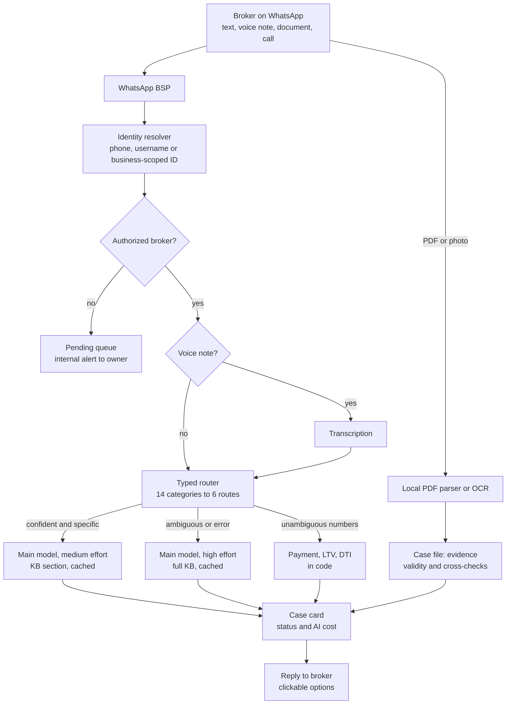

# 04 · Ianna: a WhatsApp copilot for mortgage brokers, shipped in 18 days

| | |
|---|---|
| **Company** | LQN Hipotecas (product name: Superbroker) |
| **My role** | Owner and builder, working with coding agents. Architecture, model choice, cost model, every deploy |
| **Timeline** | 18 days and 34 merged PRs, from the first conversation on WhatsApp to cases tracked as CRM cards with cost per case |
| **Cost** | About USD 0.41 per broker in variable cost. Cost per turn cut 10x with prompt caching |

## Context

LQN works with independent mortgage brokers. They ask the same questions all day: will this client pass at this bank, what is the payment, which documents are missing, is this certificate still valid. A human support team answered by WhatsApp. We had a history of 22,698 questions, 4,898 of them labeled by topic. The answers depended on the credit policies of 7 partner banks, which change often and sometimes contradict each other.

## What I built

Ianna is an AI assistant that brokers talk to on WhatsApp, by text, voice note or phone call.

- **Pre-qualification.** The broker gives the numbers (income type, income, age, debts, property value, down payment, term). Ianna returns which partner banks the case would pass, where it fails and why, and an exact payment estimate. A data point that rules out banks (credit score, delinquency, age) is flagged in the same message, with the cutoffs.
- **Typed routing.** Before the main model runs, a typed-judgment model (TypeSafe Jev) classifies the message into a taxonomy I derived from the 4,898 labeled questions: 14 categories mapped to 6 routes. Above 0.78 confidence, a specific task gets medium reasoning effort and only the relevant section of the knowledge base. Everything else (ambiguous, multi-topic, low confidence, attachments, router errors) gets high effort and the full knowledge base. The router never writes answers, never does math, never decides policy.
- **Math in code.** When the broker gives unambiguous parameters, payment, loan-to-value and debt-to-income are calculated in code, not by the model.
- **Documents.** Digital PDFs are parsed locally at no cost. Scans and photos go to OCR. Extracted fields land in a per-case file as evidence, and a traffic light checks validity windows (for example, an employment letter older than 30 days) and cross-checks ID number, account holder and income (more than 10% gap gets flagged).
- **Voice.** Voice notes are transcribed, classified and passed to a typed extractor that only saves facts stated explicitly. Phone calls go to a voice agent with a Colombian Spanish voice. The voice agent is kept warm only during business hours to control cost.
- **Cases as CRM cards.** Each client becomes a card with a short case code, a status (open, profiled, ready, submitted, dropped) and the AI cost per case. An admin panel shows conversations, call recordings with transcripts, and cost per profile, per ready case and per submission.

## Key decisions and trade-offs

**1. Model choice by cost and quality, tested on real questions.** The main model is a mid-tier OpenAI model through OpenRouter. Its output tokens cost about 15x less than a Sonnet-class model. I re-tested with a newer Claude Sonnet on five real questions: it was more consistent on complex profiling, but twice as slow, 3 to 20 times more expensive per turn, and it needed code changes (our runner sent a parameter the new model rejects, and its longer reasoning would have hit our token cap). I kept the cheaper model and wrote down exactly what to change first if we switch.

**2. Cache the knowledge base, and stop trimming it.** Marking the knowledge-base block as cacheable took a turn from about USD 0.007 to about USD 0.0007. The surprise: an earlier optimization that trimmed the knowledge base per task was defeating the cache, because the provider only caches identical prefixes. A stable, cached full KB was cheaper than a smaller, changing one.

**3. The typed router decides the source, never the answer.** It returns a category with a probability. Code maps categories to routes and sets the threshold. I log only aggregates (category, route, confidence, tokens, latency), never the message text or client data.

**4. No outbound follow-ups.** Ianna answers what people write. It does not send reminders or chase brokers. That is a product decision: the channel should never feel like spam. Internal alerts go to the team, not to brokers.

**5. "Ready to submit" means ready for a human.** One service account, brokers never hand over credentials, and the actual bank submission stays a human step in the back office.

**6. Stay in scope.** Weather, football, jokes or opinions about competitors get one short reply that brings the broker back to the client in progress. Questions about a bank, a rate unit or the minimum wage stay in scope.

## Results

| Result | Type |
|---|---|
| Shipped in 18 days with 34 merged PRs | Measured |
| Cost per turn cut 10x through prompt caching | Measured |
| About USD 0.41 variable cost per broker, plus about USD 41/month fixed | Modeled from real usage |
| Cost per case visible live in the admin panel | Measured |

The per-broker figure is a model built from real usage counters. When I built it, no case had yet reached bank submission, so the full journey cost was assumed, not observed. The model is editable and I recalibrate it with each real case.

## What broke and what I learned

- **Authorized brokers got no reply.** Meta started rolling out WhatsApp usernames and, for some users, sent only a business-scoped user ID with no phone number. Our strict schema rejected the whole webhook. Fix: an identity resolver (phone, then alias, then username, then the scoped ID) and outbound sends by recipient ID when there is no phone. Lesson: validate strictly, but don't let one missing field drop a whole event.
- **The voice agent kept interrupting itself.** Echo on the call tripped the voice activity detector about 0.3 seconds into each answer. Raising the thresholds fixed it.
- **Calls dropped after about 90 seconds.** Background conversation was being transcribed as fragments of Hindi and English. Each fragment opened a new user turn and cut her off, she went silent, and the call ended. Fixes: language pinned to Colombian Spanish, three words minimum before a user can interrupt, and the session ends cleanly when the caller's track ends.
- **A local text-to-speech model took 14 seconds to the first byte** on the hosted voice tier. Switched to a hosted voice with a Colombian accent. The first one I picked turned out to be a Mexican voice; check the accent metadata, not the name.
- **The knowledge base contradicted itself** (two income thresholds for the same bank in two sections). Added an explicit precedence rule (the most recent back-office update wins) and listed the open conflicts for the credit team to confirm.
- **Production was ahead of `main`.** Hotfixes deployed by file copy left the server ahead of the repo. Before every deploy I now diff file hashes between the server and `main`.
- **History was expiring.** Chat history had a 90-day TTL and a cap of 1,000 messages per person. The team needed the conversations for analysis, so history no longer expires and is exported daily. The bot's short working memory stays separate.

## Stack

TypeScript · Node · Hono · Redis · OpenRouter (OpenAI and Anthropic models) · TypeSafe Jev (typed judgments) · Gemini (transcription) · local PDF parsing and hosted OCR · Pipecat (voice) · WhatsApp Cloud API through a BSP · systemd · DigitalOcean
