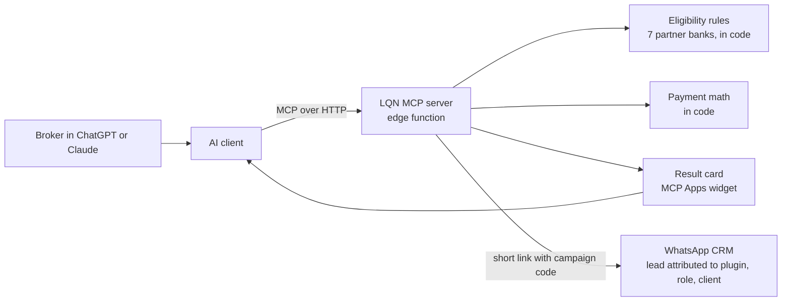

# 05 · LQN inside ChatGPT and Claude: a remote MCP server

| | |
|---|---|
| **Company** | LQN Hipotecas |
| **My role** | Built and shipped it, working with coding agents. Wrote the submissions to both directories |
| **Timeline** | Started the day after OpenAI announced plugins (late September 2026). Live in both clients within days |
| **Status** | Submitted to the OpenAI and Anthropic app directories, in review |

## Context

Most brokers in Colombia work alone, from their phone, and already use ChatGPT or Claude. We wanted to meet them there. The first experiment was low-tech: a link that loads LQN's pre-qualification prompt into the broker's own ChatGPT or Claude, ending with a "Submit with LQN" button that opens our WhatsApp CRM with a campaign code. It worked, but a prompt can't enforce rules and free chat models got the math wrong. When OpenAI opened plugins, I moved the logic into a server we control.

## What I built

A remote MCP server with five tools:

- **Profile a deal.** Returns which partner banks the case passes, why the others fail, and a rendered card (an MCP Apps widget) with the result.
- **Simulate a payment.** Exact monthly payment from amount, rate and term.
- **Submit with LQN.** A short link that opens the WhatsApp CRM with a code like `PLUGIN-<role>-<client>`, so the lead arrives attributed to the plugin, the role and the AI client.
- **How to earn with LQN.** Explains the broker and referral programs.
- **Profile a home-equity loan** for the in-house lender, behind a kill switch.

The server knows three roles: a broker already working with LQN, a broker who has not joined yet, and a referrer who only wants to pass a client along. Each gets different next steps.

## Key decisions and trade-offs

**1. Eligibility lives in code, not in the model.** A broker reported that an assistant recommended a state lender that is not one of our partners. That was enough. The server now evaluates the 7 partner banks with deterministic rules taken from the same knowledge base the WhatsApp copilot ([case 04](04-ianna-broker-copilot.md)) uses, and the server instructions tell the model to repeat that list as returned: no adding, removing or reordering banks. The model explains; the code decides.

**2. Numbers only, no personal data.** The tools take figures, never names or ID numbers. If a user pastes them anyway, the instructions tell the model to ask them to delete it. Results are always framed as indicative: the bank decides.

**3. No authentication.** It is a public pre-qualification tool with no personal data, so I left auth off to remove friction. The trade-off is that anyone can call it, which is acceptable for what it exposes.

**4. Some things are never published.** A guard test fails the build if the referral payout percentage ever appears in the server's text. Commercial terms belong in a conversation with the team, not in a chatbot answer.

**5. Kill switch per product.** The in-house lender's tool shipped behind an environment flag on the hosting project. Turning it off is one variable, no deploy.

**6. Hosting on an edge platform.** I used Cloudflare Pages in advanced mode instead of Workers, because the deploy tokens we had were scoped to Pages. It has been enough for a stateless MCP server.

## Results

| Result | Type |
|---|---|
| Live in ChatGPT and Claude, tested end to end in both | Measured |
| Submitted to the OpenAI and Anthropic app directories | Measured, both in review |
| Leads arrive in the CRM attributed by role and AI client | Measured |

## What broke and what I learned

Most of the work was in platform details nobody documents in one place:

- **OpenAI does not let you add an MCP server to an existing plugin.** You create a new plugin.
- **Tool descriptions can't name other tools** in one of the directories, so descriptions had to be rewritten.
- **Claude caches the widget's resource URI.** Changing the card without changing its URI did nothing. I version the URI and accept old versions too.
- **The widget's size-changed message must include both width and height,** or the card renders cut.
- **Reconnecting the server in the developer portal reset the auth mode** to OAuth. It has to be set back to "none" every time.
- **`wa.me` links broke four-byte emojis** in the prefilled message. The short link now redirects to the full WhatsApp API URL.
- **ChatGPT rewrites `utm_source`** to its own domain but keeps `utm_campaign`, so attribution rides on the campaign field.
- **Free chat models miscalculated the payment** in the prompt-only version (off by about 4%). In the prompt version I gave them a "payment per million borrowed" table so they only multiply. In the MCP version the server does the math.

## Stack

Model Context Protocol (streamable HTTP) · MCP Apps (UI widget) · JavaScript on Cloudflare Pages Functions · WhatsApp deep links · CRM attribution codes
