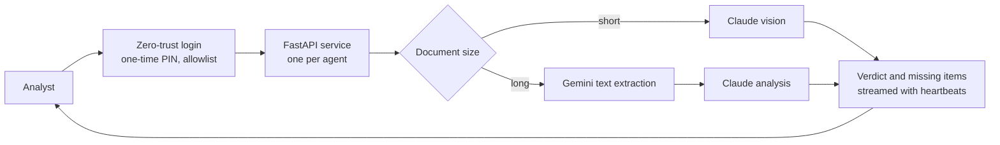

# 06 · Document-review agents: from an office PC to production

| | |
|---|---|
| **Company** | LQN Hipotecas |
| **My role** | Production owner. **A teammate on my team wrote most of the application code.** I took the agents to production, secured them, fixed what broke in production, wrote the deploy playbook and owned adoption |
| **In production since** | April 2026 |
| **Usage** | 4 agents, 13 to 17 authorized users each |
| **Cost** | About USD 5 per month per agent in hosting, plus model usage |

## Context

The most common reason a mortgage file stalls is an incomplete document package. A file goes to the bank missing a page, a certificate is expired, or a property document doesn't match the application. The bank sends it back, and the case loses days in two teams at once.

A teammate had built AI agents that check these packages. They worked, but they ran on an office PC, which meant they were down whenever the office power or internet was.

## What the agents do

Four FastAPI services, each for one point in the funnel:

1. **Pre-submission check.** Before a file goes to a bank: application form, ID, income documents.
2. **Pre-closing check.** After approval: title certificate, deeds, purchase agreement, approval letter, insurance policies.
3. **Mortgage file analyzer** for the US partner, in six analysis modules.
4. **Credit-risk analyst** for the in-house lender.

Short documents go to Claude vision. Long ones are first converted to text with Gemini, then analyzed by Claude. Results stream to the browser over server-sent events with heartbeats, because a large package can take minutes.

## What I did

- **Deployment.** Moved each agent to a managed platform (DigitalOcean App Platform, smallest tier) on its own subdomain, with secrets stored encrypted by the platform and the local spec file shredded after use.
- **Access.** Put each agent behind Cloudflare Access with one-time PINs and an email allowlist. No code changes, free up to 50 users, and adding or removing a person takes a minute.
- **Edge protection.** WAF managed rules and rate limiting on the zone.
- **A deploy playbook as a coding-agent subagent.** I wrote the steps (repo checks, build detection, secrets, spec, domain, access policy, alerts) as a Claude Code subagent. The next two agents deployed on the same day by following it.
- **Production fixes** (below), runbooks, and the access list for each team.

## Key decisions and trade-offs

**1. Managed platform over our own server.** About USD 5 a month per agent, isolated from each other and from the operations agent's server. If one dies, the others keep working.

**2. Zero-trust login instead of building auth.** Faster and safer than adding login code to four apps. The trade-off: usage is hidden behind the login, so we can't see who actually uses the agent without instrumenting the app itself.

**3. One documented exception.** The analyzer for the US partner integrates with another company's systems, so it went live without the login, with rate limiting at the edge instead. I wrote down why, and that it is temporary.

**4. No document storage.** The agents do not keep PDFs or a history of verdicts. That is good for privacy and bad for learning: there is no dataset of "agent said X, human found Y". I flagged it as the next step (log package analyzed, verdict, analysis time, human correction, final loan outcome) rather than pretend it existed.

## Results

| Result | Type |
|---|---|
| 4 agents in production, 13 to 17 authorized users each | Measured |
| 9-document packages processed in about 3 minutes server-side, after the timeout fix | Measured |
| About USD 5/month hosting per agent | Measured |
| Effect on bank returns for incomplete documents | Not measured yet |

## What broke and what I learned

- **A platform update wiped the secrets.** I updated the app spec without the secret values and the platform replaced them with nothing. The app answered 500 "API key not configured", and the front end, which did not handle a 500, showed an infinite spinner. Fixes: the playbook always applies a complete spec, every deploy ends with a smoke test against the public URL, and the front end now shows the error. (The smoke test then taught me the next lesson: two apps had no health endpoint, so a healthy app looked broken. A health endpoint is now on the checklist for every agent.)
- **Large packages timed out.** The switch from vision to text extraction started at 20 pages. Lowering it to 3 pages made big packages fast enough to finish.
- **The build failed to detect Python** because the repo had `requirements_x.txt` instead of `requirements.txt`. The platform looks for the exact file name before it runs any build command.
- **The login could be bypassed.** The apps were still reachable at the platform's default URL, outside the zero-trust domain. Lesson: a login in front of a domain protects the domain, not the app. Restrict ingress or validate the access token inside the app.
- **Access is not adoption.** With the login in front, real usage was invisible unless the app itself logged it. Authorizing 13 to 17 people per agent says nothing about how many packages they check. The next step is logging each package analyzed and its outcome, and putting the check inside the step people already do.

## Stack

Python · FastAPI · Claude (vision and analysis) · Gemini (text extraction) · server-sent events · DigitalOcean App Platform · Cloudflare DNS, Access, WAF and rate limiting · Claude Code subagent for deploys
