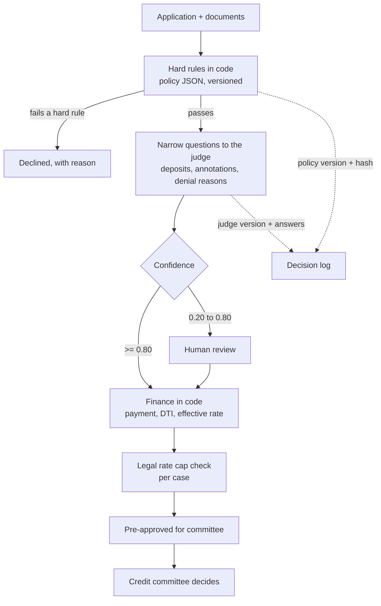

# 07 · Origination engine: credit rules in code, judgment from an LLM, decisions by a committee

| | |
|---|---|
| **Company** | HipoCredit, LQN's in-house lender |
| **My role** | Research, design and v0.1 build, working with coding agents. I review and merge every change |
| **Status** | v0.1, October 2026. 40/40 on the validation set, 19 automated tests, CI green. Not yet deciding real loans |

## Context

HipoCredit lends to people banks often turn down: self-employed borrowers without formal payroll, or buyers who need to close faster than a bank can. Those are exactly the cases where the decision depends on reading messy evidence: bank statements, property records, the reason a bank said no.

Two constraints shaped the design. First, the lender wants to sell its loan book later, and buyers need a clean, auditable trail for every decision. Second, the people who own the credit policy are credit experts, not programmers, and they need to change it without waiting for an engineer.

## What I built

A decision engine with one hard rule in its README: **code decides, the model judges, the committee approves.** The best possible output is "pre-approved for committee". The engine never approves a loan on its own.

- **Policy as data.** Limits (loan-to-value, amounts, terms, age, score, debt ratios) live in versioned JSON files, not in code. Every change is recorded in a decisions file with who decided it and the source.
- **Rules and finance in code.** Eligibility, payment, debt-to-income, and the all-in effective rate including fees.
- **Typed judgments from an LLM.** A typed-judgment model (TypeSafe Jev) answers narrow questions with a probability: is this bank-statement line a business deposit, what does this property-record annotation mean, why did the bank deny this case. It never does arithmetic.
- **Thresholds and a human lane.** At 0.80 confidence or more the judgment is used automatically; between 0.20 and 0.80 it goes to human review.
- **Audit trail.** Each decision records the policy version and its hash, the judge model version, and a log of every judgment.
- **Bank-statement income.** For self-employed borrowers, income is estimated from statements using rules adapted from US non-QM lending: a business-expense factor, a minimum history, flags for atypical deposits and for falling income. These are marked as assumptions until the credit team confirms them.

## How non-programmers change the policy

- Each credit analyst works from their own laptop with Claude Code or Codex. The assistants read `CLAUDE.md` and `AGENTS.md`, which say what can be changed and what needs my approval.
- Every change is a pull request. CI runs the 19 tests and one sample case against the real judge model, and posts the result as a PR comment.
- I review and merge. Nobody else pushes to `main`.
- **Nobody needs an API key.** The judge model's key lives in a small edge function that only accepts callers whose GitHub token has access to the repo. Remove someone from the repo and the model stops working for them.
- **No personal data in the repo.** Real exports are worked in an ignored local folder, and the repo rejects spreadsheets, CSVs and PDFs.

## Key decisions and trade-offs

**1. Narrow judgments instead of a "credit analyst" prompt.** A single prompt that reads everything and returns "approve" is easy to demo and impossible to audit or sell. Narrow questions with probabilities can be tested one by one, thresholded in code and sent to a human when uncertain.

**2. The legal rate cap is checked on the all-in cost.** Once origination and broker fees are included, the effective rate of some products can cross Colombia's legal usury ceiling. The engine computes the all-in rate per case and caps it, and the question went to legal counsel instead of being assumed away.

**3. Assumptions are labeled as assumptions.** Several rules from an older internal model are computed as signals but switched off until the credit lead confirms them. The decisions file lists what is decided and what is still open, with an owner for each.

## Results

| Result | Type |
|---|---|
| 40/40 on the validation set | Measured, synthetic set |
| 19 automated tests, offline, in CI | Measured |
| A research package of 9 reports (benchmarks, regulation, risk, fraud, integrations, data) behind the design | Delivered |

Honest limits: the validation set is synthetic and the 0.80/0.20 thresholds were set on it. They need recalibration with real documents before the engine touches a real decision.

## What I learned

- **Put the item inside the question.** When the judge received a list of bank-statement lines in its context and was asked about "item 3", accuracy dropped to 75%. Putting the line's text directly in the question, with a short glossary, got 40/40.
- **The signal is in the documents.** Using historical data, application form fields predicted bank approval for self-employed borrowers with an AUC of only about 0.66. Form data alone is a weak filter; the evidence that matters is in statements and records. That is why the judgment layer exists.
- **Regulation shapes the buyer, not just the loan.** Colombia's mortgage securitizer only buys from supervised originators. If the plan is to sell the book, the audit trail has to be designed for that buyer from day one.

## Stack

Python · uv · JSON policy files · TypeSafe Jev (typed judgments) · pytest · GitHub Actions · Cloudflare Pages Functions (key proxy) · Claude Code and Codex for non-technical contributors
