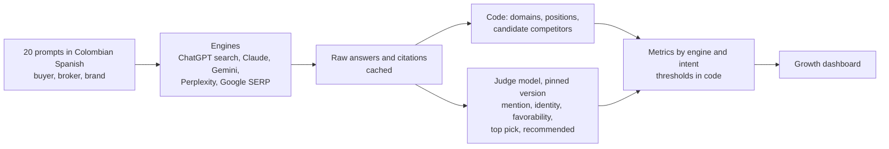

# 08 · SEO, GEO and AI visibility: fix indexing first, then measure what the AIs say

| | |
|---|---|
| **Company** | LQN Hipotecas |
| **My role** | Owner. Diagnosis, tooling, content changes, measurement, working with coding agents |
| **Timeline** | Mid-September to early October 2026 |
| **Results** | Daily Google impressions up 8–9x in three weeks (about 150 to 1,000–1,400). Indexed pages from 7 of 34 to 30 of 41 |

## Context

LQN had two public domains. One was a WordPress site with mortgage landing pages by city and bank, a payment simulator and a blog. The other was a single-page React app that was broken for search: an expired certificate on its canonical host, no sitemap or robots file, identical meta tags on every page, dead subdomains still indexed, and a development back-office host showing up in Google.

Search Console data only went back a few days, so there was no history to compare against. The baseline was about 15 clicks per business day, mostly people searching for the brand.

## The finding

The team's instinct was to write more content. The data said otherwise: **only 7 of 34 pages were indexed.** City pages and the simulator sat in "crawled, not indexed"; the broker guides in "discovered, not indexed". The bottleneck was indexing, not content.

## What I built and did

- **Audit and consolidation plan** for both domains and the other domains the company owned: which one wins, the redirect map, and what access was missing (DNS, hosting, registrar).
- **Indexing in batches.** Search Console allows about 11 manual indexing requests a day. I requested them in prioritized batches. The first 11 pages were indexed within minutes, which proved the lever worked. Then the rest, batch by batch.
- **An LLM-assisted prioritizer that judges but does not write.** For each query, a typed-judgment model (TypeSafe Jev) returns intent, business fit, whether the ranking page actually answers it, whether it looks like an AI-assistant prompt, and whether it is plausibly Colombian. The priority score is a formula in code: 0.30 impressions + 0.20 position gap + 0.30 intent value + 0.20 fit, times an evidence discount for low-volume queries. Title and meta candidates are written by hand; the model only ranks them. Judgments are cached by hash, so changing weights costs zero API calls.
- **Content QA:** FAQ sections with schema on money pages, internal links across 16 pages, and short "in 30 seconds" summaries.
- **Calculators for long-tail questions.** "How much does it cost to close on a home in Colombia" had hundreds of daily impressions on one guide. I turned the guide into a calculator. It became the top page. An appraisal-cost calculator followed.
- **Page-level attribution.** Every WhatsApp button on the site carries the page it came from, and the CRM ([case 03](03-whatsapp-crm-voice-agent.md)) records it as the lead source.
- **A blog-comment lead router.** Comments are judged (spam, lead type, intent, city, expects a reply). Code decides: approve, hold for a human, spam, and whether it becomes a hot lead in the CRM. Dry-run by default; uncertain cases go to a human.
- **A public quarterly mortgage index** built from the company's own pipeline data, with privacy rules enforced in code and tests: cells with fewer than 30 cases are suppressed, cells where one originator is over 50% are dropped from the public version, banks are anonymized, and broker identifiers are hashed with a per-run random salt that is never stored.
- **An AI visibility tracker** (below) and a weekly SEO report that runs on a schedule.

## The AI visibility tracker

The question: when a Colombian asks an AI assistant about mortgages, or about becoming a mortgage broker, does it mention LQN? If not, whom does it recommend?

Design choices:

- **Code extracts candidates; the judge only selects.** It never generates competitor names.
- **The judge version is pinned** so week-over-week changes reflect the AIs, not a new judge.
- **Thresholds are constants in code** and can be re-applied to cached answers without new calls.
- **Each engine skips itself** and reports "pending key" if its credential is missing, so a partial run is still useful.

Baseline (late September 2026): the brand is well defended (4 of 4 brand queries in Google's top 10, average position 1.8), but on generic questions LQN was nearly invisible: 2 of 16 in Google's top 10 and no citations in Claude's search results. Banks, comparison sites and one proptech competitor won those answers. A useful seed: Gemini, without searching, already associated LQN with "platform for brokers" in 2 of 3 broker questions.

## Key decisions and trade-offs

**1. Measure before writing.** The plan that would have felt productive (more articles) would not have moved anything while 27 pages were invisible.

**2. `llms.txt` and markdown copies are hygiene, not a bet.** There is no measurable effect yet. The levers that matter for AI answers are a consistent entity (name, one canonical sentence, complete organization schema), ranking in the search engines the assistants use, and being cited by third parties. The metric that matters is leads arriving from AI referrers, not mentions.

**3. Typed judgments over generated copy.** Using the model as a judge with explicit weights made every recommendation explainable and cheap to recompute.

## Results

| Result | Type |
|---|---|
| Daily Google impressions up 8–9x in three weeks, about 150 to 1,000–1,400 | Measured, Search Console |
| Indexed pages: 7 of 34 to 30 of 41 | Measured, Search Console |
| AI visibility baseline across ChatGPT, Claude, Gemini and Perplexity, with a re-measure scheduled | Measured |
| Effect of new titles and FAQs on click-through rate | Still being measured |

## What broke and what I learned

- **The main domain was about to expire,** with no transfer lock and nobody sure who owned the registrar account. Ownership of domains is a business risk, not an IT detail.
- **A forgotten code snippet overrode the SEO plugin.** Titles changed in the plugin did not show up because a snippet mapped page slugs to titles and won. Always check what renders, not what the admin says.
- **The CMS inserted `
` tags inside scripts** in page content when the JavaScript contained literal tags. Escaped the characters.
- **A SERP API without geo parameters** returned US, Mexican and Chilean results for Colombian queries. Switched to a provider that accepts country and language.
- **Partner banks changed names and owners.** Pages still named former partners. Fixed with 301 redirects, and found a trap on the way: image attachments with the same slug as the old pages redirected those URLs to the home page.
- **Free model tiers are not enough for measurement.** Grounded search was not in Gemini's free tier, and the quota ran out halfway through 20 prompts.

## Stack

Python · Google Search Console API · Bing Webmaster · SERP and crawl APIs through Composio · TypeSafe Jev · OpenAI, Anthropic, Gemini and Perplexity APIs · WordPress with Rank Math · schema.org · cron
