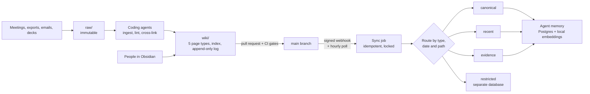

# 09 · The knowledge system: a company wiki that humans read and agents maintain

| | |
|---|---|
| **Company** | LQN Hipotecas |
| **My role** | Designed it and maintain the conventions. Coding agents do most of the writing; I review |
| **Size** | 400+ wiki pages, 60+ decision records, about 9.5K documents in the operations agent's memory |
| **Started** | April 2026 |

## Context

When I joined, knowledge about how loans actually move lived in people's heads, slide decks and meeting recordings. Two directors could describe the same process in two different ways. Every new agent I built needed that context, and every new person did too.

## What I built

One Git repository that works as the control plane for both people and agents.

- **`raw/`** holds immutable sources: meeting transcripts, exports, decks, emails. Agents never edit it.
- **`wiki/`** is written and maintained by LLM agents, following five page types with required frontmatter and sections: person, entity (bank, tool, competitor), meeting, decision, and dataset. Every page needs at least one inbound link. Cross-references go both ways.
- **`index.md`** is the catalog and **`log.md`** is an append-only history of every ingest and every lint run.
- **`AGENTS.md`** is the entry point for any coding agent: what to read first, editing rules, standard commands and the definition of done. `CLAUDE.md` holds the long domain context.
- **A lint gate** checks orphans, dangling links and incomplete frontmatter, and runs in CI with the rest of the quality gates.
- **Workflows** for the three things people ask for: ingest a source, answer a question from the wiki (and offer to save the answer), and run a health check.

The wiki feeds the operations agent's memory ([case 01](01-manolito-ops-agent.md)):

## Key decisions and trade-offs

**1. The wiki is the map, not the runtime.** Obsidian is where people read. Git is where changes are reviewed and rolled back. The agent's memory is a derived copy. If the memory breaks, it is rebuilt from Git.

**2. Decision records are mandatory for anything that matters.** Each one has context, options with pros and cons, the decision, the expected consequences and the owner. Decisions are reversed in the open: a record marked "reverted" links to the one that replaced it. Many of the case studies in this repo are summaries of those records.

**3. Layers instead of one big index.** Canonical pages (processes, policies) answer "how should this work". Recent pages answer "what happened this week". Evidence holds reports and extracts. Fundraising material is restricted, stored in a separate database, excluded from the normal sync, and never visible to the operations agent's general users.

**4. Sync is boring on purpose.** It is idempotent (no change, no work), uses a file lock so the webhook, the timer and manual runs never overlap, validates isolation and counts after each run, and only saves its checkpoint when the run finishes clean.

**5. Discrepancies are written down, not resolved silently.** When two sources disagree on a name, a date or a number, the page marks the conflict and, if it needs a decision, a decision record is opened.

## Results

| Result | Type |
|---|---|
| 400+ wiki pages, 60+ decision records | Measured |
| About 9.5K documents in agent memory, refreshed within seconds of a merge | Measured |
| Every coding agent session starts from `AGENTS.md` and the index, and closes with the lint gate | By design |

## What broke and what I learned

- **The agent quoted an old version of a page.** The text syncs in seconds, but embeddings can be recomputed on a different cycle. When an answer looks stale, check the vector, not just the page.
- **Pages too large to ingest.** The memory tool takes content as a shell argument, and Linux limits argument size. Large pages are now stored as header plus recent tail, with a visible compaction marker. Git keeps the full text.
- **Two memories with the same name.** A local memory server on my laptop and the production one on the server had drifted apart. When an answer looks stale, check which instance answered.
- **Consumers wrote back.** The agent committed frontmatter changes directly on the server's copy of a vault, which blocked fast-forward syncs for days. Consumers now mirror `main` and propose changes by pull request.

## Stack

Obsidian · Git and GitHub · Markdown with YAML frontmatter · Make targets for lint and verify · GitHub webhooks with HMAC · Postgres with local embeddings (Ollama) · systemd timer · Claude Code and Codex as maintainers
