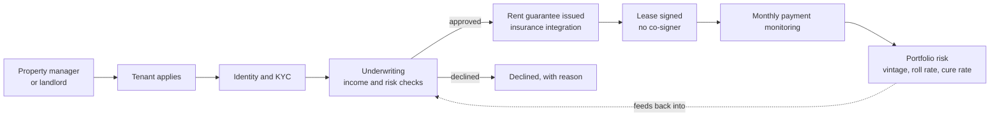

# 10 · DORA: replacing the co-signer in Colombian leases

| | |
|---|---|
| **Company** | DORA, rental guarantee and tenant screening (backed by 500 Global LatAm) |
| **My role** | CEO and co-founder, March 2022 to October 2025 |
| **Outcome** | Profitable and acquired |
| **Recognition** | Forbes Colombia Top 100 Startups to Watch (2024) |

This one is not an AI system. It is the company I built before, and it explains how I think about the ones above.

## Context

To rent a home in Colombia, a tenant usually needs a co-signer who owns property and is willing to be liable for the rent. Many good tenants (young professionals, people who moved cities, people whose family does not own property) don't have one. Landlords and property managers, on their side, need to know the rent will be paid.

DORA screened the tenant and guaranteed the rent to the landlord, replacing the co-signer.

## What I built and ran

- **Underwriting.** A screening and decision process with KYC and insurance integrations, so a tenant could get an answer without a co-signer.
- **Portfolio risk.** Tracking of the guaranteed book by vintage, roll rate and cure rate, so we could see whether newer cohorts behaved better or worse than older ones before the losses showed up.
- **Distribution.** Most growth came through partnerships with property managers and landlords, who brought tenants to us as part of their own leasing process.
- **Capital.** Raised USD 264K in equity and USD 101K in debt, and reached profitability.

## Results

| Result | Type |
|---|---|
| 2,000 tenants in 15 cities | Company result |
| USD 380K ARR | Company result |
| USD 700K in rent guaranteed per month (USD 8.4M annualized) | Company result |
| 0.8% default rate | Company result |
| CAC from USD 130 to USD 40 | Company result |
| USD 264K equity and USD 101K debt raised, profitable, acquired | Company result |

## What I carried into AI work

- **A decision you can't reproduce is a liability.** In underwriting, every approval has to be explainable later, to a partner, an insurer or a regulator. That is why my AI systems keep rules in code, version the policy, log the judge's version and freeze the data used for any decision that moves money ([case 02](02-lqn-world-gamified-ops.md), [case 07](07-origination-engine.md)).
- **Look at cohorts, not averages.** Vintage analysis taught me that a blended rate hides what is happening to the newest loans. I apply the same thinking to conversion rates and to agent performance: same-month ratios mislead, cohorts don't.
- **Distribution beats features.** Partners who already own the customer relationship are the cheapest channel. At LQN that means brokers first, and meeting them where they already work: WhatsApp, ChatGPT and Claude ([case 05](05-mcp-plugin-chatgpt-claude.md)).
- **Know your loss before you know your growth.** Keeping defaults low and bringing CAC down both depend on the same discipline: decide who you serve, measure it every month, and say no early.

Before DORA I ran a SaaS assistant for real estate agents (Operadoor) and a co-living business with 105 tenants in 38 rooms (Welcome District). Leasing is the domain I know best, and mortgages are the next step of the same customer's journey.

## Stack and skills

Underwriting and KYC · insurance partnerships · portfolio risk (vintages, roll and cure rates) · B2B2C partnerships with property managers · equity and debt fundraising · P&L ownership
